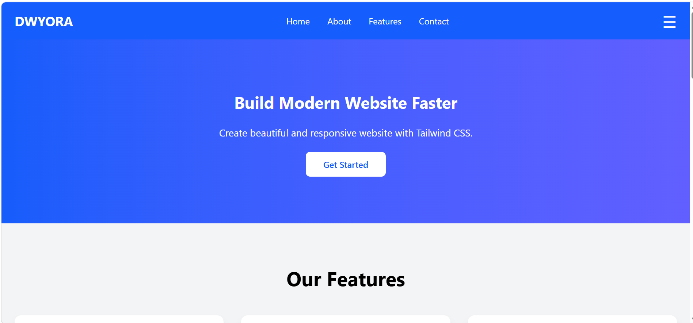
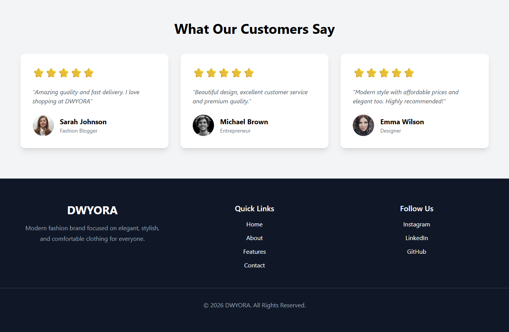

# 🚀 DWYORA - Tailwind Landing Page

A modern and responsive landing page built with HTML and Tailwind CSS.

## ✨ Features

- Responsive Navigation
- Sticky Navbar
- Mobile Hamburger Menu
- Hero Section
- Features Section
- About Section
- Achievement Section
- Testimonials Section
- Footer
- Smooth Scrolling
- Hover Animations
- Responsive Layout

## 🛠️ Built With

- HTML5
- Tailwind CSS
- JavaScript

## 📱 Responsive

- Desktop
- Tablet
- Mobile

## 📷 Preview

### 🖥️ Hero & Navbar



### ✨ About & Features


### 💬 Testimonials & Footer



### 📱 Tablet View


### 📱 Mobile View


## 📂 Folder Structure

```
tailwind-landing-page/
│
├── index.html
├── input.css
├── output.css
├── package.json
├── tailwind.config.js
└── README.md
```

## 🚀 Getting Started

Clone this repository

```bash
git clone https://github.com/nancydwiyanti/tailwind-landing-page.git
```

Install dependencies

```bash
npm install
```

Run Tailwind CSS

```bash
npm run watch
```

---

Made with ❤️ by DWYORA